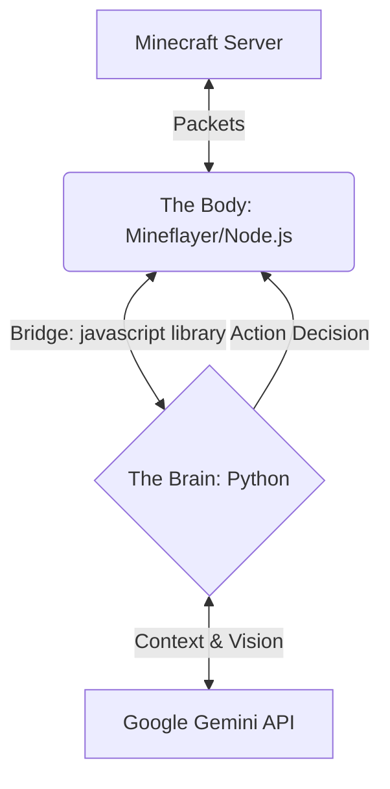

# NeuroBlock: An Embodied AI Agent for Minecraft


**NeuroBlock** is a research-grade embodied AI agent capable of playing Minecraft. 

Unlike traditional bots that use hard-coded scripts, this project uses **Google Gemini** (via the Google Gen AI SDK) as a high-level cognitive "Brain" to plan, perceive, and execute complex tasks. The agent connects to the game using a hybrid **Python-JavaScript bridge**, combining the rich AI ecosystem of Python with the robust bot physics of Mineflayer.

## 🏗️ Architecture

The project uses a **Brain-Body-Bridge** architecture to ensure stability and modularity.



* **The Body (Node.js):** Handles low-level physics, pathfinding, block raycasting, and server packets via `mineflayer`.
* **The Bridge:** Uses the `javascript` Python library to run the Body as a sub-process, allowing direct control from Python without context switching.
* **The Brain (Python):** Uses Google Gen AI (and planned ADK integration) for reasoning, task decomposition, and tool usage.

## 🚀 Getting Started

### Prerequisites
* **Node.js** (v18 or later)
* **Python** (v3.10 or later)
* **Minecraft Java Edition**
* **Google AI Studio API Key**

### Installation

1.  **Clone the repository**
    ```bash
    git clone [https://github.com/yourusername/NeuroBlock.git](https://github.com/yourusername/NeuroBlock.git)
    cd NeuroBlock
    ```

2.  **Install The "Body" (Node.js dependencies)**
    Initialize the Node environment and install the physics engine.
    ```bash
    npm init -y
    npm install mineflayer mineflayer-pathfinder minecraft-data
    ```

3.  **Install The "Brain" (Python dependencies)**
    Install the bridge and AI SDK.
    ```bash
    pip install -r requirements.txt
    ```

4.  **Configure Environment**
    Create a `.env` file in the root directory:
    ```ini
    GOOGLE_API_KEY=your_api_key_here
    # Optional: Server Details
    MC_HOST=localhost
    MC_PORT=25565
    ```

### Usage

1.  **Start a Minecraft World:**
    * Open Minecraft Java Edition.
    * Pause > Open to LAN > Start LAN World.
    * Note the **Port Number** (e.g., `56789`).

2.  **Run the Agent:**
    Update the port in `src/main.py` (or pass it as an argument) and run:
    ```bash
    python src/main.py
    ```

3.  **Interact:**
    * The bot will join as `GeminiPro` (or the name you configured).
    * **Chat Control:** Type in game chat to give instructions like *"Come here"* or *"Describe what you see"*.
    * **Terminal Control:** Use the Python terminal to issue debug commands.

## 🗺️ Roadmap

- [x] **Phase 1: The Puppet** - Establish Python-to-Mineflayer bridge and basic movement.
- [ ] **Phase 2: The Sense** - Implement "Vision" (Block raycasting) and "Proprioception" (Inventory/Health status).
- [ ] **Phase 3: The Brain** - Integrate Google Gemini for basic instruction following ("Come here").
- [ ] **Phase 4: The Planner** - Implement Task Decomposition (e.g., "Build a house" -> "Gather Wood" -> "Craft Planks").
- [ ] **Phase 5: The Memory** - Add vector database (Chroma/Pinecone) for long-term memory of locations and events.

## 🤝 Contributing

This is an open research project. Pull requests are welcome for new "Tools" (skills the bot can learn) or architectural improvements.

## ⚠️ Disclaimer

This project is not affiliated with Mojang Studios or Microsoft. Use responsibly on public servers to avoid bans.
